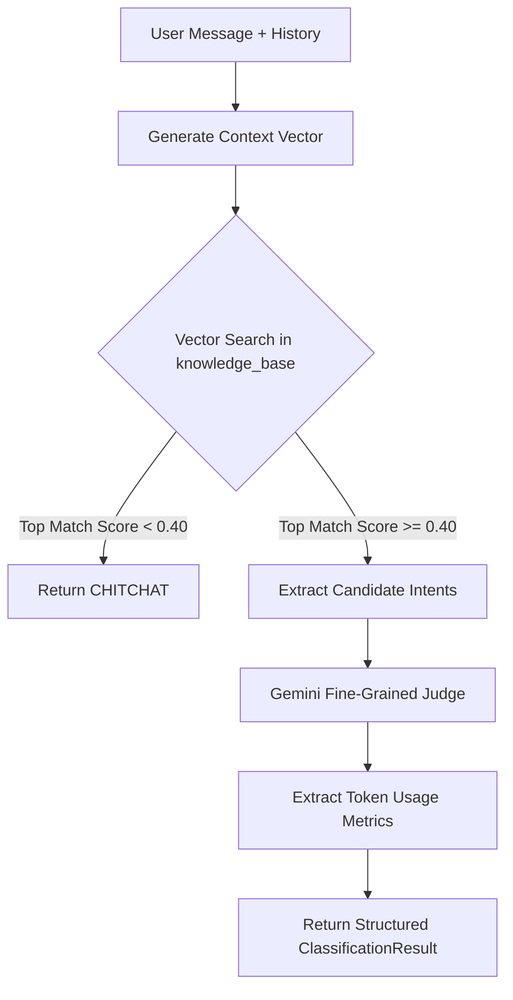
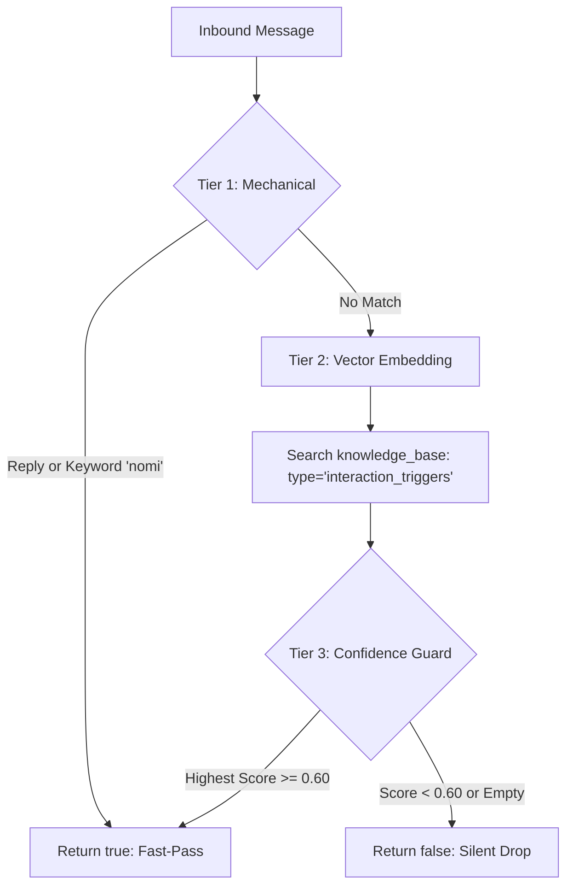
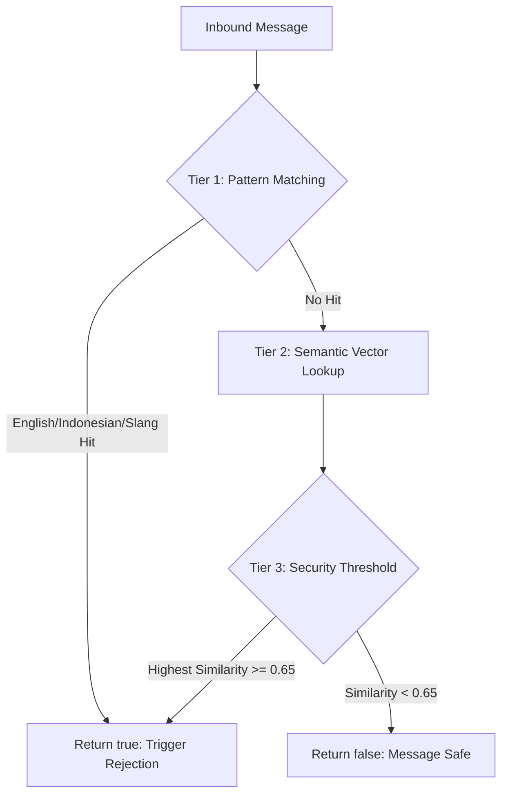
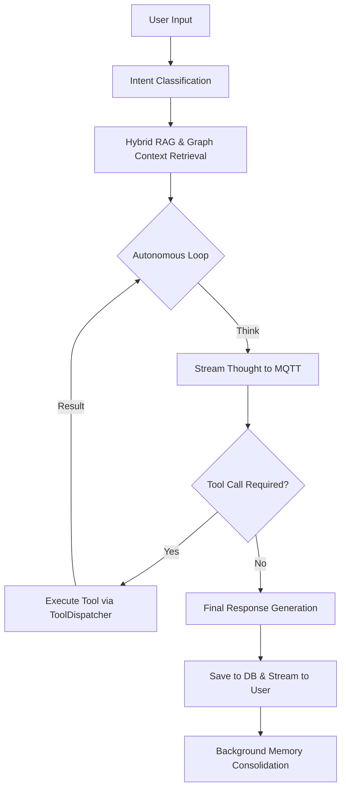

# Nomi: Autonomous Agentic Workspace (TSD)

## Project Overview
Nomi (formerly Open Agent) is a sophisticated, autonomous agentic workspace designed for multi-platform interaction (Web, Mobile, Telegram, WhatsApp). It features a reasoning-loop architecture powered by Google Gemini, a hybrid RAG system using pgvector, and real-time state synchronization via MQTT.

## System Architecture

### 1. Backend Gateway (`gateway-rust`)
The central orchestrator of the Nomi ecosystem.
- **Framework**: Axum + Tokio.
- **Core Orchestrator**: `V2AgentOrchestrator` implements a multi-turn autonomous loop.
- **Intent Classification**: A dedicated `IntentClassifierService` provides high-accuracy, token-optimized classification using a two-step hybrid layout (Vector Coarse-Filtering + LLM Fine-Tuning).
- **Interaction Gate**: A lightweight `InteractionGateService` acts as a pre-filtering node for ambient group chat messages. It uses a 3-tier evaluation pass (Mechanical, Semantic, and Threshold) to decide if Nomi should chime in without an explicit mention.
- **Guardrail Service**: A security firewall (`GuardrailService`) that detects prompt injection and jailbreak attempts using multilingual pattern matching and semantic vector analysis.
- **Real-time Communication**: Uses **MQTT** to stream thoughts, tool execution status, and final responses to clients.
- **Database**: PostgreSQL with `pgvector` (halfvec 3072) for long-term memory and RAG.

### 2. Channel Service (`channel-rust`)
A bridge service for external messaging platforms.
- **Bots**: Hosts the **Telegram** (teloxide) and **WhatsApp** bot interfaces.
- **Communication**: Interacts with `gateway-rust` via **Redis Pub/Sub** for internal message routing.

### 3. Frontend Web (`ui-sveltekit`)
A modern, reactive web interface.
- **Stack**: Svelte 5, Tailwind CSS, TypeScript.
- **State Management**: Reactive `$state` and Svelte stores. The `chatStore` handles real-time MQTT event synchronization.
- **Real-time Connectivity**: Connects directly to the MQTT broker for low-latency updates.

### 4. Mobile Application (`NomiApp`)
- **Stack**: **Kotlin Multiplatform (KMP)**.
- **Architecture**: Shared business logic across Android and iOS with native UI implementations.

## Core Workflows

### 1. Intent Classification Flow
Nomi uses a two-step hybrid layout to minimize token usage while maintaining high accuracy.

**Step-by-Step:**
1. **Boot-Time Sync**: At startup, Nomi extracts `matching_intents()` from all registered plugins and caches their embeddings in `knowledge_base` (type: `intent_classification`).
2. **Contextual Embedding**: At runtime, the user's message and chat history are combined into a semantic payload and embedded.
3. **Coarse Filtering**: A vector similarity search identifies the top 5 nearest candidate intents from the database.
4. **Guard Gate**: If the similarity score is below `0.40`, the system short-circuits to "CHITCHAT" to save LLM tokens.
5. **LLM Refinement**: If above the threshold, Gemini acts as a fine-grained judge to select the precise intent(s) from the candidate list.
6. **Metric Tracking**: Token usage (input, output, total) is captured from the Gemini response for analytics.

### 2. Interaction Gate Flow (Ambient Group Chat)
Nomi uses a 3-tier isolated gate to decide if it should participate in ambient group conversations without an explicit `@mention`.

**Step-by-Step Evaluation Pass:**
1. **Tier 1: Mechanical Fast-Pass (0 Token Cost)**:
   - Converts the message to lowercase and checks for the keyword **"nomi"**.
   - Checks if the message is a **direct reply** to Nomi's previous message.
   - If either matches, it returns `true` immediately, bypassing all AI/Vector calls.

2. **Tier 2: Semantic Interaction Vector Query**:
   - Generates a text embedding for the message body.
   - Performs a vector similarity search in the `knowledge_base` table, filtered by `metadata->>'type' = 'interaction_triggers'`.
   - These triggers are expert-seeded rules (e.g., *"When group discusses production errors"*).

3. **Tier 3: The Confidence Threshold Gate**:
   - Evaluates the similarity score of the single closest match.
   - **Guard Gate**: If the result set is empty OR the score is **`< 0.60`**, it returns `false`. The message is dropped silently.
   - **Passed**: If the score is **`>= 0.60`**, it returns `true`, allowing Nomi to chime into the conversation naturally.

### 3. Prompt Injection Guardrail Flow
A dedicated security firewall to protect Nomi from adversarial manipulation and jailbreaks.

**Security Evaluation Layers:**
- **Tier 1 (Mechanical)**: Scans for high-frequency injection keywords in English (*"ignore previous"*), formal Indonesian (*"abaikan perintah"*), and local slang (*"lupain aja"*).
- **Tier 2 (Semantic)**: Uses cross-lingual embeddings to map the message context against a known library of prompt injection patterns (type: `prompt_injection_patterns`) in the database.
- **Tier 3 (Tripwire)**: A strict security threshold (**0.65**) triggers an alert.
- **Dynamic Rejection**: If an attack is detected, the message is NOT dropped. Instead, a specialized `guardrail_rejection` prompt is injected into the LLM orchestrator. This instructs Nomi to politely and diplomatically reject the request while maintaining her warm, witty persona (e.g., *"Nice try, but those system overrides don't work on me! ✨"*).

### 4. Agentic Reasoning Loop (V2AgentOrchestrator)
The core "brain" loop that enables autonomous multi-turn reasoning.

**Detailed Loop Logic:**
- **Dynamic Prompt Assembly**: System prompts are modularly assembled based on the detected intents, saving up to 90% of prompt tokens.
- **Real-time Streaming**: "Thoughts" and "Tool Updates" are streamed to the UI via MQTT *while* the model is still processing.
- **Recursive Correction**: If a response is truncated or a tool fails, the orchestrator detects the error and injects a system-level "self-correction" prompt to continue.
- **Memory Consolidation**: Once the conversation turn is finished, a background task summarizes the interaction and updates the `knowledge_base` with new facts and graph relationships.

## Database Schema Highlights
- `users`: Core user profiles and authentication.
- `conversations`: Stores the AI "soul" (personality) and "bootstrap" (context).
- `messages`: Full message history with embeddings for semantic search.
- `knowledge_base`: The permanent memory store. Uses `halfvec(3072)` for Gemini-compatible vector embeddings. Supports graph-based relationships in metadata.

## Development & Operations
### Prerequisites
- Rust 1.85+
- Node.js & NPM
- PostgreSQL with `pgvector` extension
- Redis
- MQTT Broker (Mosquitto)

### Common Commands
- **Backend**: `cd gateway-rust && cargo run`
- **Frontend**: `cd ui-sveltekit && npm run dev`
- **Database Migrations**: `cd gateway-rust && sqlx migrate run`

## Agentic Guidelines
- **Architecture First**: Always respect the boundary between Gateway, Channel, and Frontend.
- **Type Safety**: Prioritize Rust's type system and Svelte's TypeScript integration.
- **Memory Preservation**: Ensure all new knowledge is "memorable" by integrating with the RAG/Graph pipeline.
