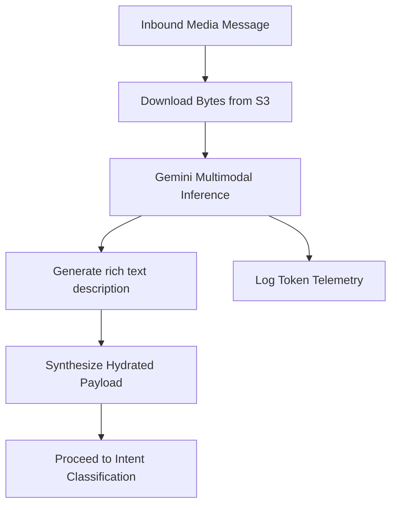
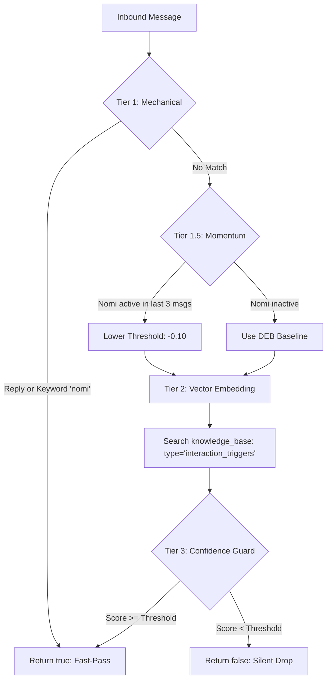
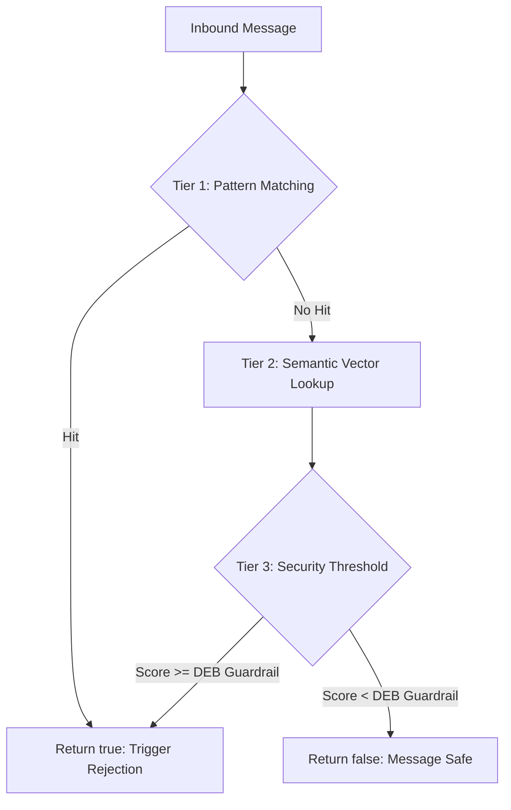
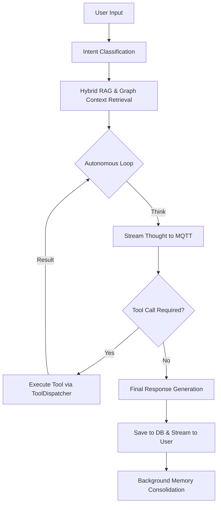
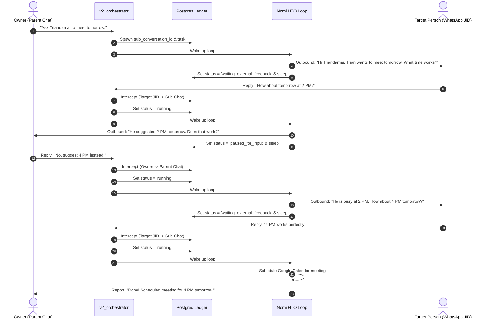
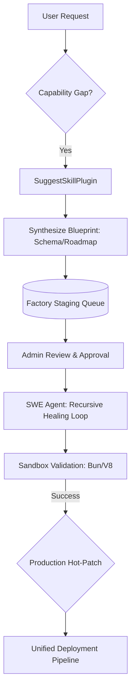

# Nomi: Autonomous Agentic Workspace (TSD)

## Project Overview
Nomi (formerly Open Agent) is a sophisticated, autonomous agentic workspace designed for multi-platform interaction (Web, Mobile, Telegram, WhatsApp). It features a reasoning-loop architecture powered by Google Gemini, a hybrid RAG system using pgvector, and real-time state synchronization via MQTT.

## System Architecture

### 1. Backend Gateway (`gateway-rust`)
The central orchestrator of the Nomi ecosystem.
- **Framework**: Axum + Tokio.
- **Core Orchestrator**: `V2AgentOrchestrator` implements a multi-turn autonomous loop.
- **Intent Classification**: A dedicated `IntentClassifierService` provides high-accuracy, token-optimized classification using a two-step hybrid layout (Vector Coarse-Filtering + LLM Fine-Tuning).
- **Interaction Gate**: A lightweight `InteractionGateService` acts as a pre-filtering node for ambient group chat messages. It uses a 3-tier evaluation pass (Mechanical, Semantic, and Threshold) to decide if Nomi should chime in without an explicit mention.
- **Guardrail Service**: A security firewall (`GuardrailService`) that detects prompt injection and jailbreak attempts using multilingual pattern matching and semantic vector analysis.
- **Ambient Soul Service**: A background intelligence worker (`AmbientSoulService`) that passively extracts long-term memories from group chats and controls proactive, autonomous agent initiatives using a Redis TTL cooldown state lock.
- **Plugin Trait**: A dedicated plugin trait  (`NomiPliginTool`) for create new skills.
- **Real-time Communication**: Uses **MQTT** to stream thoughts, tool execution status, and final responses to clients.
- **Database**: PostgreSQL with `pgvector` (halfvec 3072) for long-term memory and RAG, plus a dedicated `token_usage_history` ledger for tracking LLM token metrics system-wide.

### 2. Channel Service (`channel-rust`)
A bridge service for external messaging platforms.
- **Bots**: Hosts the **Telegram** (teloxide) and **WhatsApp** bot interfaces.
- **Communication**: Interacts with `gateway-rust` via **Redis Pub/Sub** for internal message routing.

### 3. Frontend Web (`ui-sveltekit`)
A modern, reactive web interface.
- **Stack**: Svelte 5, Tailwind CSS, TypeScript.
- **State Management**: Reactive `$state` and Svelte stores. The `chatStore` handles real-time MQTT event synchronization.
- **Real-time Connectivity**: Connects directly to the MQTT broker for low-latency updates.

### 4. Mobile Application (`NomiApp`)
- **Stack**: **Kotlin Multiplatform (KMP)**.
- **Architecture**: Shared business logic across Android and iOS with native UI implementations.

## Core Workflows

### 1. Multimodal Context Hydration (Media Interpreter)
Before user messages reach the classification logic, Nomi "sees" and "hears" media attachments to hydrate the conversation context.



**Operational Mechanics:**
- **Multimodal Interception**: The `MediaInterpreterService` intercepts S3 media URLs (Images and Audio) from incoming messages.
- **Multimodal Inference**:
   - **Images**: Extracts OCR text, financial amounts, code snippets, and environmental scenery.
   - **Audio**: Transcribes vocal spoken wording cleanly into text.
- **Context Hydration**: The result is synthesized into a bracketed header (e.g., `[Media Context Description: <Result>] <User Caption>`), allowing downstream text-only systems (Interaction Gate, Intent Classifier) to process the media context as if it were natural language.

### 2. Intent Classification Flow
Nomi uses a hybrid two-step process to identify user intent while minimizing token consumption.

**Workflow:**
1. **Context Creation**: Combines the user's latest message with a summary of recent chat history.
2. **Embedding Generation**: Produces a high-dimensional vector of the context.
3. **Coarse Filtering**: A vector similarity search identifies the top 5 nearest candidate intents from the database.
4. **Guard Gate**: If the similarity score is below the dynamic **DEB threshold**, the system short-circuits to "CHITCHAT".
5. **LLM Refinement**: If above threshold, Gemini acts as a judge to select precise intent(s).
6. **Metric Tracking**: Token usage is captured for system-wide analytics.

### 3. Dynamic Execution Boundaries (DEB)
Nomi's behavior is governed by per-conversation **Dynamic Execution Boundaries**, allowing for localized tuning of proactivity, intelligence, and security.

#### The Three Layers of DEB:
1. **Sociability (`interaction_gate`)**: Controls participation in group chats.
   - `<= 0.25`: **Proactive Mode** 🏁
   - `<= 0.50`: **Balanced Mode** 🤝
   - `<= 0.75`: **Conservative Mode** 🛡️
   - `> 0.75`: **Silent Monitor Mode** 🤫

2. **Confidence (`intent_classification`)**: Controls the similarity threshold for tool triggering.
   - `<= 0.40`: **Experimental Mode** 🧪
   - `<= 0.70`: **Adaptive Mode** 🏎️
   - `> 0.70`: **Strict Mode** 📐

3. **Vigilance (`guardrails`)**: Controls prompt injection detection sensitivity.
   - `<= 0.50`: **Permissive Mode** 🔓
   - `<= 0.80`: **Standard Mode** 👤
   - `> 0.80`: **Hardened Shield Mode** 🌋

#### AI-Driven Calibration:
Nomi can self-tune these boundaries using the `adjust_deb` tool when users give behavioral feedback (e.g., *"be more proactive"* or *"stay silent"*).

### 4. Interaction Gate & Momentum Flow (Ambient Group Chat)
Nomi uses a multi-tier isolated gate to decide if it should participate in ambient group conversations without an explicit `@mention`.



**Step-by-Step Evaluation Pass:**
1. **Tier 1: Mechanical Fast-Pass (0 Token Cost)**: Checks for the keyword **"nomi"** or if the message is a **direct reply** to Nomi.
2. **Tier 1.5: Conversation Momentum**: If Nomi spoke within the **last 3 messages**, the DEB `interaction_gate` threshold is lowered by **0.10** (capped at 0.10).
3. **Tier 2: Semantic Interaction Vector Query**: Vector similarity search in `knowledge_base` (type='interaction_triggers').
4. **Tier 3: The Confidence Threshold Gate**: Evaluates similarity against the dynamic DEB threshold.

### 5. Prompt Injection Guardrail Flow
A dedicated security firewall to protect Nomi from adversarial manipulation.



**Security Evaluation Layers:**
- **Tier 1 (Mechanical)**: Scans for high-frequency injection keywords in English, formal Indonesian, and local slang.
- **Tier 2 (Semantic)**: Uses cross-lingual embeddings to map the context against a known library of injection patterns.
- **Tier 3 (Tripwire)**: Uses the dynamic DEB `guardrails` threshold as a tripwire.
- **Dynamic Rejection**: If an attack is detected, a specialized `guardrail_rejection` prompt is injected. Nomi politely rejects the request while maintaining her persona.

### 6. Ambient Soul Initiative
Even if the Interaction Gate doesn't trigger, messages are processed for memory extraction and potential proactive interjections.

- **Passive Memory**: Node A extracts user facts and updates RAG memories asynchronously.
- **Participation Boost**: Node B uses a dynamic probability roll (**30% base, 50% with momentum**).
- **Relevance Guard**: Uses the DEB `interaction_gate` threshold as a minimum relevance requirement.
- **Cooldown**: A 15-minute per-conversation Redis lock prevents over-participation.

### 7. Agentic Reasoning Loop (V2AgentOrchestrator)
The core "brain" loop that enables autonomous multi-turn reasoning.



**Detailed Loop Logic:**
- **Dynamic Prompt Assembly**: System prompts are modularly assembled based on the detected intents, saving up to 90% of prompt tokens.
- **Real-time Streaming**: "Thoughts" and "Tool Updates" are streamed to the UI via MQTT *while* the model is still processing.
- **Recursive Correction**: If a response is truncated or a tool fails, the orchestrator detects the error and injects a system-level "self-correction" prompt.
- **Memory Consolidation**: Once the turn is finished, a background task summarizes the interaction and updates the `knowledge_base` with new facts.

### 8. Universal HTO Multi-Resurrection & Dynamic Bridging
Nomi operates a sophisticated Human-in-the-Loop (HITL) coordination and resurrection engine for background workflow steps, bridging context dynamically between distinct conversation channels.



#### Key Technical Principles:
1. **Dynamic Twin-History Hydration:** The HTO background worker prompt dynamically constructs context from **both** the parent room (Owner chat) and the sub-chat room (Target chat), allowing the LLM planner to act as a conversational bridge across channels without hardcoded routing rules.
2. **Dual-Interception Gateway Hooks:** The ingestion engine (`v2_orchestrator.rs`) contains dynamic interception hooks that intercept signals coming into target or parent conversations when in suspended states (`waiting_external_feedback` or `paused_for_input`).
3. **Universal Workflow Adaptability:** The same state machine handles both conversational sub-chat workflows and system integration tasks (like Google Docs or expense logs requesting parameter updates).

### 9. Self-Reinforcement Engine (SRP)
Nomi autonomously evolves her core tool-handling logic and architects new capabilities from scratch, transitioning from a static assistant into a self-expanding Operating System.

#### 🧠 Autonomous Evolution
- **Zero-Latency Optimization**: Background workers analyze successful interactions to extract slang and behavioral guardrails.
- **Dynamic Schema Hydration**: Learned optimizations are injected into tool schemas at runtime, bypassing binary compilation limits.

#### 🏭 Distributed Agent Factory (DAF)
Nomi identifies "capability vacuums" and proposes her own upgrades via the `suggest_new_skill` tool.



**The Autonomous Engineering Loop:**
1.  **Autonomous Blueprinting**: When a user request cannot be met, Nomi invokes `suggest_new_skill` to architect a solution (slug, parameters, roadmap).
2.  **Recursive SWE Agent**: Once approved, a dedicated SWE Agent synthesizes the TypeScript source code. It uses a **Recursive Healing Loop** to fix its own bugs in an isolated sandbox.
3.  **Human-In-The-Loop Security**: To ensure safety, only an **Admin** can trigger final deployment.
4.  **Self-Oversight**: Nomi uses `manage_skill_proposals` to monitor her engineering pipeline and inform users of build progress.

## Database Schema Highlights
- `users`: Core user profiles and authentication.
- `conversations`: Stores the AI "soul" (personality) and "bootstrap" (context). Holds **DEB gateway_thresholds**.
- `messages`: Full message history with embeddings for semantic search.
- `knowledge_base`: The permanent memory store. Uses `halfvec(3072)` for vector embeddings.

## Development & Operations

---

## 🛠️ Custom Skills & Plugins

Nomi is built for infinite extensibility. Every capability (Skill) is an isolated Rust module implementing the `NomiToolPlugin` trait.

### 1. The `NomiToolPlugin` Trait
All plugins must implement these four core methods:

```rust
pub trait NomiToolPlugin: Send + Sync {
   fn schema(&self) -> Value;
   fn rules(&self) -> &str;
   fn matching_intents(&self) -> &[&str];
   fn execute<'a>(&'a self, dispatcher: &'a ToolDispatcher, args: Value)
                  -> BoxFuture<'a, anyhow::Result<ToolResult>>;
}
```

---

### Prerequisites
- Rust 1.85+
- Node.js & NPM
- PostgreSQL with `pgvector` extension
- Redis
- MQTT Broker (Mosquitto)

### Common Commands
- **Backend**: `cd gateway-rust && cargo run`
- **Frontend**: `cd ui-sveltekit && npm run dev`
- **Database Migrations**: `cd gateway-rust && sqlx migrate run`

## Agentic Guidelines
- **Architecture First**: Always respect the boundary between Gateway, Channel, and Frontend.
- **Type Safety**: Prioritize Rust's type system and Svelte's TypeScript integration.
- **Memory Preservation**: Ensure all new knowledge is "memorable" by integrating with the RAG/Graph pipeline.


> **Design Principle:** *Architecture First. Type Safety Always. Memory is Permanent.*
