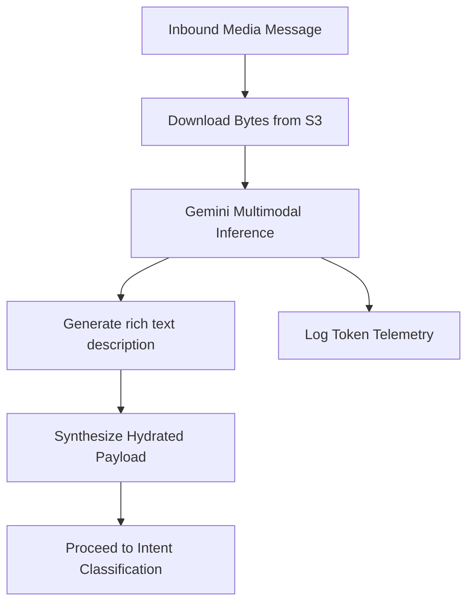
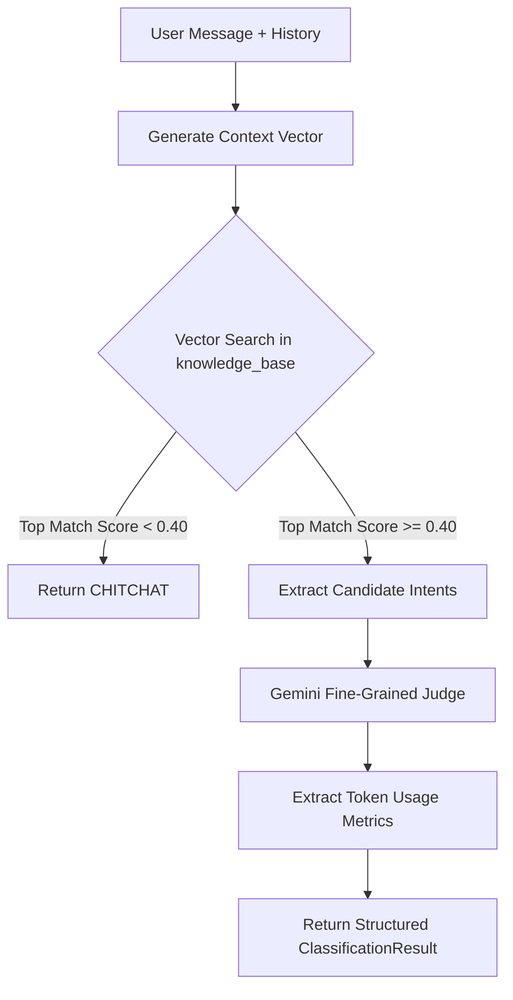
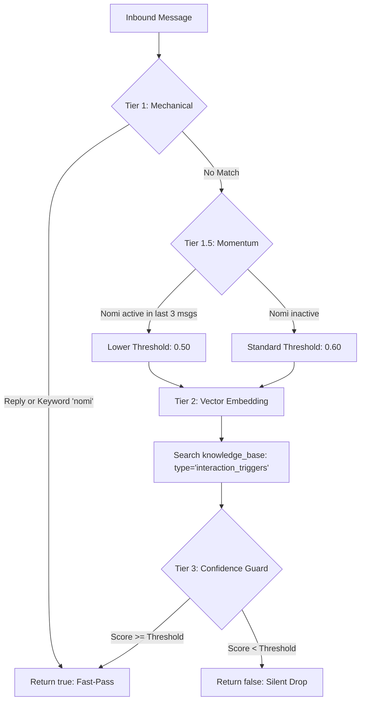
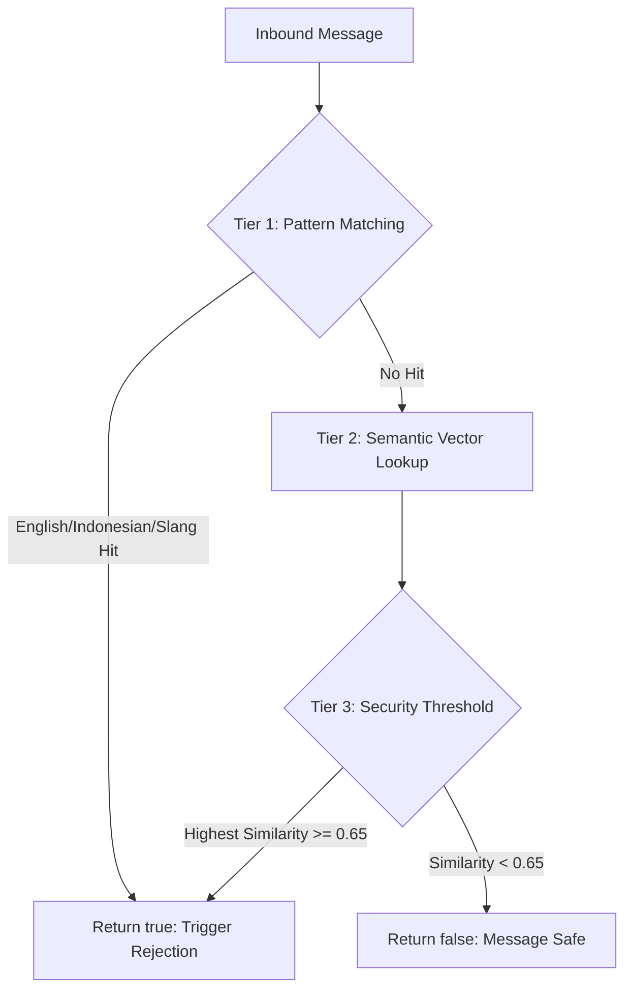
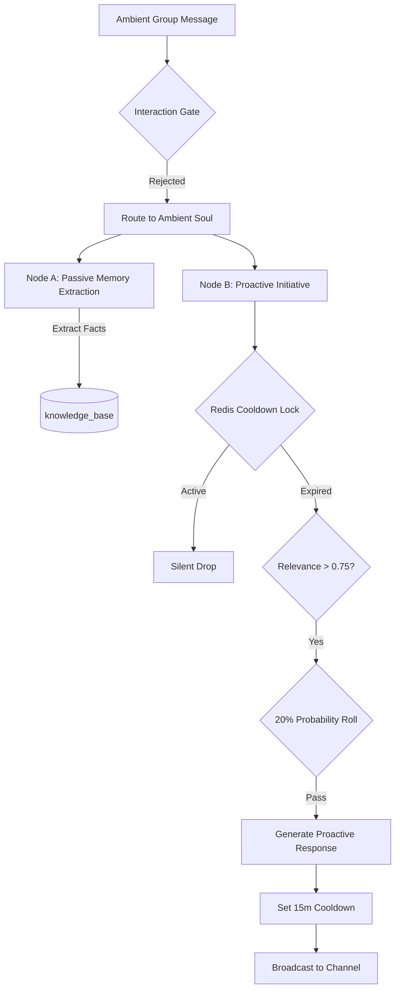
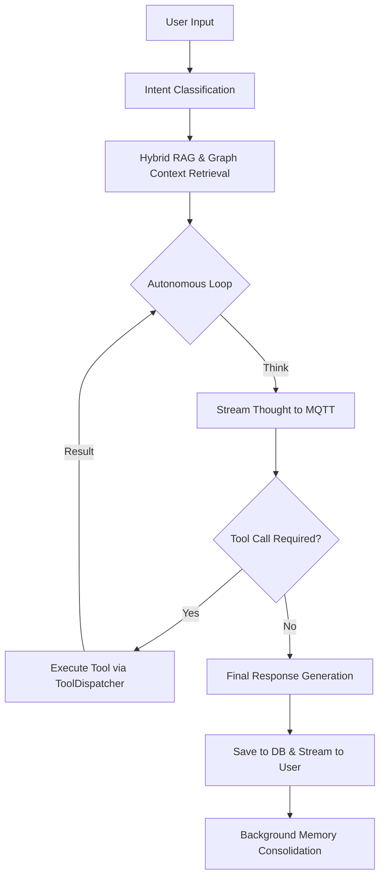
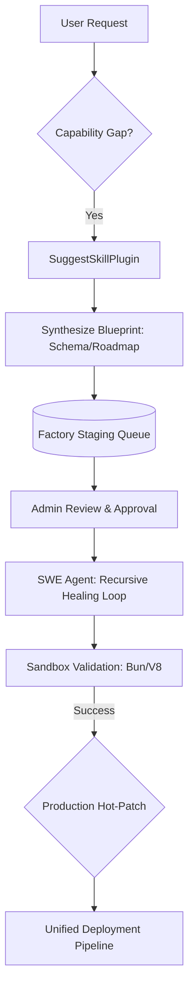

# Nomi: Autonomous Agentic Workspace (TSD)

## Project Overview
Nomi (formerly Open Agent) is a sophisticated, autonomous agentic workspace designed for multi-platform interaction (Web, Mobile, Telegram, WhatsApp). It features a reasoning-loop architecture powered by Google Gemini, a hybrid RAG system using pgvector, and real-time state synchronization via MQTT.

## System Architecture

### 1. Backend Gateway (`gateway-rust`)
The central orchestrator of the Nomi ecosystem.
- **Framework**: Axum + Tokio.
- **Core Orchestrator**: `V2AgentOrchestrator` implements a multi-turn autonomous loop.
- **Intent Classification**: A dedicated `IntentClassifierService` provides high-accuracy, token-optimized classification using a two-step hybrid layout (Vector Coarse-Filtering + LLM Fine-Tuning).
- **Interaction Gate**: A lightweight `InteractionGateService` acts as a pre-filtering node for ambient group chat messages. It uses a 3-tier evaluation pass (Mechanical, Semantic, and Threshold) to decide if Nomi should chime in without an explicit mention.
- **Guardrail Service**: A security firewall (`GuardrailService`) that detects prompt injection and jailbreak attempts using multilingual pattern matching and semantic vector analysis.
- **Ambient Soul Service**: A background intelligence worker (`AmbientSoulService`) that passively extracts long-term memories from group chats and controls proactive, autonomous agent initiatives using a Redis TTL cooldown state lock.
- **Plugin Trait**: A dedicated plugin trait  (`NomiPliginTool`) for create new skills.
- **Real-time Communication**: Uses **MQTT** to stream thoughts, tool execution status, and final responses to clients.
- **Database**: PostgreSQL with `pgvector` (halfvec 3072) for long-term memory and RAG, plus a dedicated `token_usage_history` ledger for tracking LLM token metrics system-wide.

### 2. Channel Service (`channel-rust`)
A bridge service for external messaging platforms.
- **Bots**: Hosts the **Telegram** (teloxide) and **WhatsApp** bot interfaces.
- **Communication**: Interacts with `gateway-rust` via **Redis Pub/Sub** for internal message routing.

### 3. Frontend Web (`ui-sveltekit`)
A modern, reactive web interface.
- **Stack**: Svelte 5, Tailwind CSS, TypeScript.
- **State Management**: Reactive `$state` and Svelte stores. The `chatStore` handles real-time MQTT event synchronization.
- **Real-time Connectivity**: Connects directly to the MQTT broker for low-latency updates.

### 4. Mobile Application (`NomiApp`)
- **Stack**: **Kotlin Multiplatform (KMP)**.
- **Architecture**: Shared business logic across Android and iOS with native UI implementations.

## Core Workflows

### 1. Multimodal Context Hydration (Media Interpreter)
Before user messages reach the classification logic, Nomi "sees" and "hears" media attachments to hydrate the conversation context.



**Operational Mechanics:**
- **Multimodal Interception**: The `MediaInterpreterService` intercepts S3 media URLs (Images and Audio) from incoming messages.
- **Multimodal Inference**:
   - **Images**: Extracts OCR text, financial amounts, code snippets, and environmental scenery.
   - **Audio**: Transcribes vocal spoken wording cleanly into text.
- **Context Hydration**: The result is synthesized into a bracketed header (e.g., `[Media Context Description: <Result>] <User Caption>`), allowing downstream text-only systems (Interaction Gate, Intent Classifier) to process the media context as if it were natural language.
- **Token Logging**: Parallel, non-blocking telemetry logs the LLM cost of the interpreter turn to the `token_usage_history` ledger.

### 2. Intent Classification Flow
Nomi uses a two-step hybrid layout to minimize token usage while maintaining high accuracy.



**Step-by-Step:**
1. **Boot-Time Sync**: At startup, Nomi extracts `matching_intents()` from all registered plugins and caches their embeddings in `knowledge_base` (type: `intent_classification`).
2. **Contextual Embedding**: At runtime, the user's message and chat history are combined into a semantic payload and embedded.
3. **Coarse Filtering**: A vector similarity search identifies the top 5 nearest candidate intents from the database.
4. **Guard Gate**: If the similarity score is below `0.40`, the system short-circuits to "CHITCHAT" to save LLM tokens.
5. **LLM Refinement**: If above the threshold, Gemini acts as a fine-grained judge to select the precise intent(s) from the candidate list.
6. **Metric Tracking**: Token usage (input, output, total) is captured from the Gemini response for analytics.

### 2. Interaction Gate & Momentum Flow (Ambient Group Chat)
Nomi uses a multi-tier isolated gate to decide if it should participate in ambient group conversations without an explicit `@mention`.



**Step-by-Step Evaluation Pass:**
1. **Tier 1: Mechanical Fast-Pass (0 Token Cost)**:
   - Converts the message to lowercase and checks for the keyword **"nomi"**.
   - Checks if the message is a **direct reply** to a message where `role = 'assistant'`.
   - If either matches, it returns `true` immediately, bypassing all AI/Vector calls.

2. **Tier 1.5: Conversation Momentum**:
   - Checks the database for Nomi's recent participation in the specific conversation.
   - If Nomi has spoken within the **last 3 messages**, she enters a "flow" state.
   - **Dynamic Threshold**: Momentum lowers the semantic threshold from **0.60 to 0.50**, making her more likely to continue an ongoing discussion.

3. **Tier 2: Semantic Interaction Vector Query**:
   - Generates a text embedding for the message body.
   - Performs a vector similarity search in the `knowledge_base` table, filtered by `metadata->>'type' = 'interaction_triggers'`.
   - These triggers represent expert-seeded rules (e.g., *"When group discusses production errors"*).

4. **Tier 3: The Confidence Threshold Gate**:
   - Evaluates the similarity score of the single closest match.
   - **Passed**: If the score meets the dynamic threshold (**0.50** with momentum, **0.60** without), it returns `true`.
   - **Silent Drop**: If no triggers match or the score is below threshold, it returns `false`.

### 3. Ambient Soul Initiative
Even if the Interaction Gate doesn't trigger an immediate active response, messages are processed by **Ambient Soul** for memory extraction and potential proactive "initiative."

- **Participation Boost**: Ambient Soul uses a dynamic probability roll (**30% base, 50% with momentum**) and a lowered relevance threshold (**0.60**) to decide when Nomi should chime in with a witty or observant comment.
- **Cooldown**: A 15-minute per-conversation Redis lock prevents over-participation.

### 4. Prompt Injection Guardrail Flow
A dedicated security firewall to protect Nomi from adversarial manipulation and jailbreaks.



**Security Evaluation Layers:**
- **Tier 1 (Mechanical)**: Scans for high-frequency injection keywords in English (*"ignore previous"*), formal Indonesian (*"abaikan perintah"*), and local slang (*"lupain aja"*).
- **Tier 2 (Semantic)**: Uses cross-lingual embeddings to map the message context against a known library of prompt injection patterns (type: `prompt_injection_patterns`) in the database.
- **Tier 3 (Tripwire)**: A strict security threshold (**0.65**) triggers an alert.
- **Dynamic Rejection**: If an attack is detected, the message is NOT dropped. Instead, a specialized `guardrail_rejection` prompt is injected into the LLM orchestrator. This instructs Nomi to politely and diplomatically reject the request while maintaining her warm, witty persona (e.g., *"Nice try, but those system overrides don't work on me! ✨"*).

### 4. Ambient Soul Flow (Background Intelligence)
An asynchronous background worker that enables Nomi to passively observe, learn, and occasionally interject in group chats without explicit mentions.



**Operational Mechanics:**
- **Zero-Blocking Architecture**: Runs entirely inside asynchronous `tokio::spawn` tasks to prevent blocking the primary message routing pipelines.
- **Node A (Passive Memory)**: Uses a low-temperature Gemini call to sift through ambient logs. If it extracts a concrete user fact (e.g., *"User bought a new bike"*), it immediately generates an embedding and upserts it to the RAG memory store.
- **Node B (Proactive Initiative)**: Evaluates if Nomi should chime into the conversation unprompted. It enforces a strict **15-minute global cooldown** via a Redis `SET EX 900` state lock, a 0.75 semantic relevance guard, and a 20% randomized probability roll to prevent Nomi from becoming noisy or spammy.

### 5. Agentic Reasoning Loop (V2AgentOrchestrator)
The core "brain" loop that enables autonomous multi-turn reasoning.



**Detailed Loop Logic:**
- **Dynamic Prompt Assembly**: System prompts are modularly assembled based on the detected intents, saving up to 90% of prompt tokens.
- **Real-time Streaming**: "Thoughts" and "Tool Updates" are streamed to the UI via MQTT *while* the model is still processing.
- **Recursive Correction**: If a response is truncated or a tool fails, the orchestrator detects the error and injects a system-level "self-correction" prompt to continue.
- **Memory Consolidation**: Once the conversation turn is finished, a background task summarizes the interaction and updates the `knowledge_base` with new facts and graph relationships.

### 6. Self-Reinforcement Engine (SRP)
Nomi autonomously evolves her core tool-handling logic and **architects new capabilities from scratch**. This transitions her from a static assistant into a self-expanding Operating System.

#### 🧠 Autonomous Evolution & Learning
- **Zero-Latency Optimization**: Background workers analyze successful interactions at **0.0 Temperature** to extract slang, shorthand, and behavioral guardrails without causing semantic drift.
- **Dynamic Schema Hydration**: Learned optimizations are injected into tool schemas at runtime, bypassing binary compilation limits.
- **SRP Summary Audit**: Nomi can autonomously generate reports on her own progress via the `get_srp_summary` tool, proving her evolution through data.

#### 🏭 Distributed Agent Factory (DAF)
Nomi can now identify "capability vacuums" and **propose her own upgrades**. She doesn't just use tools; she builds them.



**The Autonomous Engineering Loop:**
1.  **Autonomous Blueprinting**: When a user request cannot be met by existing tools, Nomi invokes the `suggest_new_skill` tool to architect a solution (slug, parameters, and roadmap).
2.  **Recursive SWE Agent**: Once approved via the **Factory Console**, a dedicated background SWE Agent synthesizes the TypeScript source code. It uses a **Recursive Healing Loop** to automatically fix its own bugs in an isolated sandbox before presentation.
3.  **Human-In-The-Loop Security**: To ensure safety, only an **Admin** can trigger the final deployment. Once deployed, the plugin is instantly available to Nomi's RAG and intent classification layers.
4.  **Self-Oversight**: Nomi uses the `manage_skill_proposals` tool to monitor her own engineering pipeline and inform users of build progress.

## Database Schema Highlights
- `users`: Core user profiles and authentication.
- `conversations`: Stores the AI "soul" (personality) and "bootstrap" (context).
- `messages`: Full message history with embeddings for semantic search.
- `knowledge_base`: The permanent memory store. Uses `halfvec(3072)` for Gemini-compatible vector embeddings. Supports graph-based relationships in metadata.

## Development & Operations

---

## 🛠️ Custom Skills & Plugins

Nomi is built for infinite extensibility. Every capability (Skill) is an isolated Rust module implementing the `NomiToolPlugin` trait.

### 1. The `NomiToolPlugin` Trait
All plugins must implement these four core methods:

```rust
//Plugin
pub trait NomiToolPlugin: Send + Sync {
   // Defines the JSON schema for model-side tool calling
   fn schema(&self) -> Value;

   // Injected into the system prompt when the skill is active
   fn rules(&self) -> &str;

   // Links the tool to specific AI intentions
   fn matching_intents(&self) -> &[&str];

   // The asynchronous execution logic
   fn execute<'a>(&'a self, dispatcher: &'a ToolDispatcher, args: Value)
                  -> BoxFuture<'a, anyhow::Result<String>>;
}
```

### 2. Implementation Lifecycle
1. **Define Schema**: Create a JSON structure following the JSON Schema standard.
2. **Set Rules**: Write clear, imperative instructions for the LLM (e.g., *"Always check currency before logging"*).
3. **Map Intents**: Add your skill to relevant intent categories (e.g., `FINANCE`, `WEB`, `DASHBOARD`).
4. **Logic Hook**: Implement the `execute` method to interact with databases, external APIs, or the filesystem.
5. **Register**: Add your plugin instance to the `ToolDispatcher` hashmap in `src/common/tools/mod.rs`.

---

### Prerequisites
- Rust 1.85+
- Node.js & NPM
- PostgreSQL with `pgvector` extension
- Redis
- MQTT Broker (Mosquitto)

### Common Commands
- **Backend**: `cd gateway-rust && cargo run`
- **Frontend**: `cd ui-sveltekit && npm run dev`
- **Database Migrations**: `cd gateway-rust && sqlx migrate run`

## Agentic Guidelines
- **Architecture First**: Always respect the boundary between Gateway, Channel, and Frontend.
- **Type Safety**: Prioritize Rust's type system and Svelte's TypeScript integration.
- **Memory Preservation**: Ensure all new knowledge is "memorable" by integrating with the RAG/Graph pipeline.


> **Design Principle:** *Architecture First. Type Safety Always. Memory is Permanent.*
